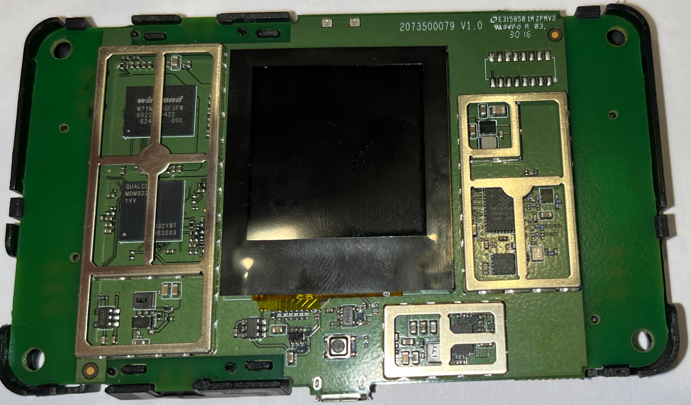
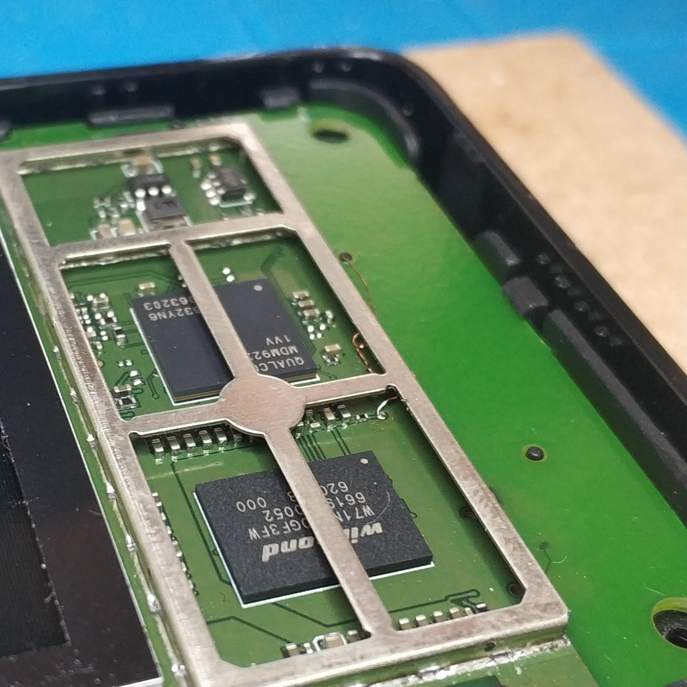
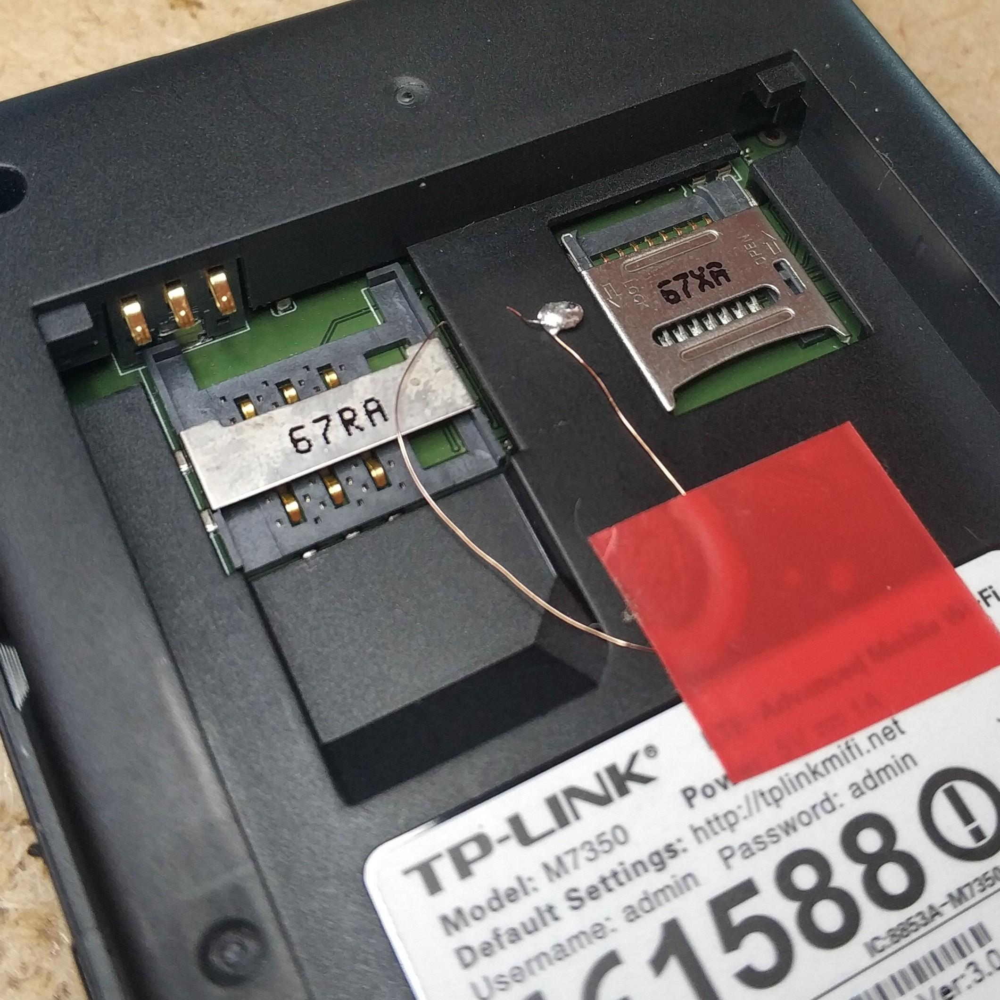

# TP-Link M7350 v3

## Components

- SoC: Qualcomm MSM 9625 (Flattened Device Tree)
- Model: Qualcomm MSM 9625V2.1 MTP
- Flash: 2Gbit (256MB) [Winbond W71NW20GF3FW](https://www.winbond.com/hq/product/code-storage-flash-memory/nand-based-mcp/index.html?__locale=en&partNo=W71NW20GF3FW)
- Mobile wireless: [Skyworks SKY77629](https://www.skyworksinc.com/Products/Amplifiers/SKY77629)

Note: The SoC is part of the [Qualcomm MDM9x25 family](
https://www.qualcomm.com/products/technology/modems/snapdragon-modems-4g-lte-x5).
They were [announced in 2012](
https://www.qualcomm.com/news/releases/2012/02/qualcomm-third-generation-lte-chipsets-are-first-support-hspa-release-10).

It is confusing why the chip is sometimes called MDM and sometimes MSM.
The package itself reads MDM.

And it has also been [used by Apple](https://theapplewiki.com/wiki/MDM9625).

## Mainline Linux

There is no mainline support as of 2025-08-18, but for the MDM9615. It may be
similar enough.

## OEM sources

Note: The display is the same between v2, v3 and [v4](README-v4.md), but
**the v3 sources do not include the display driver**.

The [display](#display) driver is in `apps_proc/kernel/drivers/oled/`.

Besides some identifiers and prints, the driver code between v2 and v4 is the
same, so you can technically take either.

However, the v2 and v3 kernels are both based on Linux 3.4.0, whereas v4 is
based on 3.18.20, so better use the sources from v2 which also contain the
device tree for the v3.

- <https://static.tp-link.com/resources/gpl/M7350v2_en_gpl.tar.gz>
- <https://static.tp-link.com/resources/gpl/M7350v3_en_gpl.tar.gz>

### Build and run the kernel

This requires the `fastboot` mechanism in the bootloader to be [unlocked](
./firmware_research/README.md#custom-kernel).

With the full vendor SDK based on OpenEmbedded and GCC 4, we were able to build
a kernel (once) that boots fine. It still differs from the image we dumped from
a real device. We are seeing a slight diff between the defconfig we dumped and
the config generated via the defconfig in the sources, indicating that they are
not exactly the same.

Using only the [kernel sources](./kernel/README.md), some necessary fixes, the
vendor defconfig and the latest Linaro GCC 4 toolchain, we have so far built a
kernel that would crash and reset.
With a reduced config and some hacks into the display driver, we confirmed that
it ran.

Note that you will need to create an Android image and include the QCDT.

The `mkbootimg` tool is part of the [Android platform system tools](
https://android.googlesource.com/platform/system/tools/mkbootimg/) and can be
found as its own package on Ubuntu based systems and others.

Use <https://github.com/rajatgupta1998/android_tools_system_dtbTool> to create
the `qcdt.bin`:

```sh
dtbTool -s 2048 -o qcdt.bin -p kernel/scripts/dtc/ kernel/arch/arm/boot/
```

```sh
QCDT=qcdt.bin
KERNEL=kernel/arch/arm/boot/Image
BOOTIMG=boot.img
PREIMG=boot_pre.img

# create Android image
mkbootimg --header_version 0 --kernel $KERNEL -o $PREIMG \
  --base 0x300000 --pagesize 2048 --tags_offset 0x6500000 \
  --cmdline " noinitrd root=/dev/mtdblock17 rw rootfstype=yaffs2 console=ttyHSL0,115200,n8 androidboot.hardware=qcom ehci-hcd.park=3 g-android.rx_trigger_enabled=1"

# concatenate with QCDT
cat $PREIMG $QCDT > $BOOTIMG

# field `unused` (dtb header version?) must be != 0
echo -en '\0001' | dd of=$IMG bs=1 seek=40 conv=notrunc

# run it
fastboot boot $BOOTIMG
```

## Photos




## EDL Mode

To gain access to EDL mode, short the test point between the SoC and the flash
part to GND when supplying power via USB with the battery detached.

Add a wire to the test point as shown here:



There is enough space to route it out to the battery slot for convenience.
With that in place, you just need to have the wire touch the SIM slot.



## Display

The display is attached to the SPI bus via the controller at `0xf992_4000`.
We could extract that information from the device trees.

The SPI controller compat string is `qcom,spi-qup-v2`.
In the vendor kernel, the SPI driver is `drivers/spi/spi_qsd.c`.
In mainline Linux, it is `drivers/spi/spi-qup.c`.

The OLED display is called
- `tplink,oleds90319` (node behind `qcom,spi-qup-v2`)
- `tp,oled_pt` -> `qcom,oled_s90319_pt`

Indeed, the side of the display (white frame) reads: `BLB-S90319B-1`

### Historical note

*Note: We had some trouble figuring out what the display really is.*

There is no such thing in the vendor kernel sources for v3 (!), nor do Google or
Bing yield anything. So it is unclear what exactly the display driver is.
It looks like a 128x128 monochrome display, similar to _SSD1306_ / _SH1107_.

From the kernel config we dumped:

```
CONFIG_OLED=y
# CONFIG_OLED_SSD1306_PT is not set
CONFIG_OLED_S90319_PT=y
```

### oledd

The binary `/usr/bin/oledd` is started via `/etc/init.d/start_oledd`.
It accesses the OLED display via sysfs:

- `/sys/class/display/oled/backlight_on`
- `/sys/class/display/oled/panel_on`
- `/sys/class/display/oled/oled_buffer`

We can echo `1` / `0` to the `*_on` files to play with the display. And we can
write to the buffer ourselves, see [mandelbrot_demo](./mandelbrot_demo/) and
[oled](./oled/).

Playing around showed that the display panel really supports colors. :rainbow:

If you want to have some fun:

```sh
/etc/init.d/start_oledd stop
echo 1 > /sys/class/display/oled/backlight_on
echo 1 > /sys/class/display/oled/panel_on
cat /dev/random > /sys/class/display/oled/oled_buffer
```

This will endlessly draw rectangles and show pixel garbage. Press Ctrl+C to stop.

<details>
  <summary>DeviceTree excerpt</summary>

```
  spi@f9924000 {
    compatible = "qcom,spi-qup-v2";
    reg = <0xf9924000 0x1000>;
    interrupts = <0x00 0x60 0x00>;
    spi-max-frequency = <0x17d7840>;
    #address-cells = <0x01>;
    #size-cells = <0x00>;
    gpios = <0x02 0x07 0x00 0x02 0x05 0x00 0x02 0x04 0x00>;
    cs-gpios = <0x02 0x06 0x00>;

    qcom-spi-oled@1 {
      compatible = "tplink,oleds90319";
      reg = <0x01>;
      spi-max-frequency = <0x927c00>;
    };
  };

  oled {
    compatible = "tp,oled_pt";

    qcom,oled_s90319 {
      compatible = "qcom,oled_s90319_pt";
      qcom,oled-cs-gpio = <0x02 0x06 0x00>;
      qcom,oled-rsx-gpio = <0x02 0x15 0x00>;
      qcom,oled-reset-gpio = <0x02 0x14 0x00>;
      qcom,oled-vdd0-gpio = <0x02 0x16 0x00>;
      qcom,oled-vdd1-gpio = <0x02 0x17 0x00>;
      qcom,oled-boost-en-gpio = <0x02 0x3d 0x00>;
    };
  };
```
</details>

<details>
  <summary>kernel log excerpt</summary>

```
[    2.042245] s90319_spi_probe successed!
[    2.045067] oled_90319_panel_init success.
[    2.049204] oled_probe
[    2.051692] oled_s90319_probe
[    2.054716] oled init success!
```
</details>

