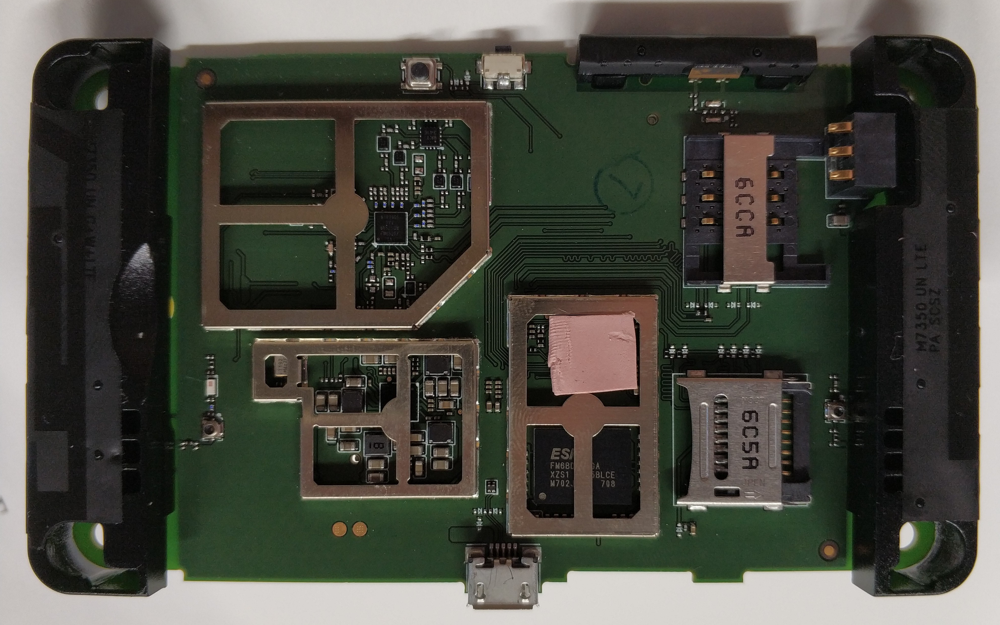

# Device Infos

TP Link Router M7350 v4

SoC: Qualcomm MDM 9607

This hardware revision has a different NAND flash than v3.

The display is the same.

The main SoC is on the top side, and similar to [this Quectel modem](
https://pallavaggarwal.in/2023/11/08/quectel-ec25-cellular-modem-teardown/).

## Photos

