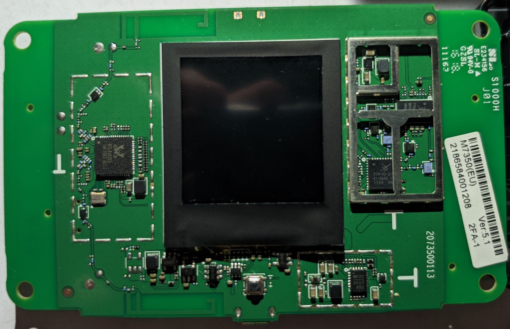
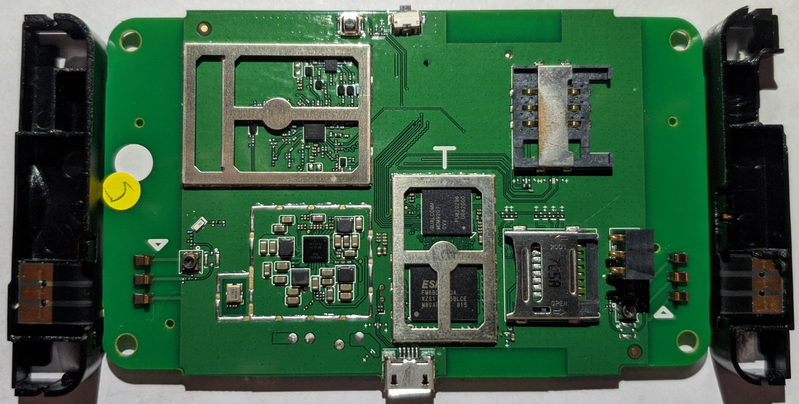

# TP-Link M7350 v5

## Components

- SoC: Qualcomm MDM 9207

- Support: <https://www.tp-link.com/en/support/download/m7350/v5/#Firmware>

- Emulator: <https://emulator.tp-link.com/M7350v5/dist/login.html>
  (password: `admin`)

## OEM Sources

- <https://static.tp-link.com/resources/gpl/M7350v5_en_gpl.tar.gz>

## Photos

