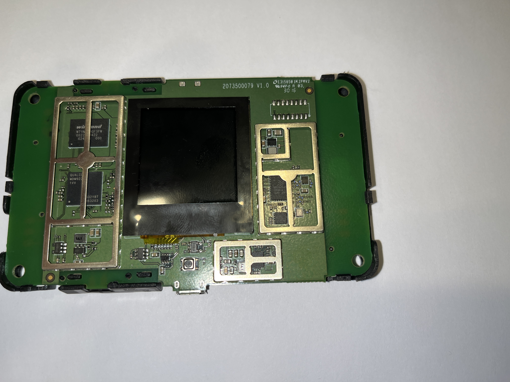
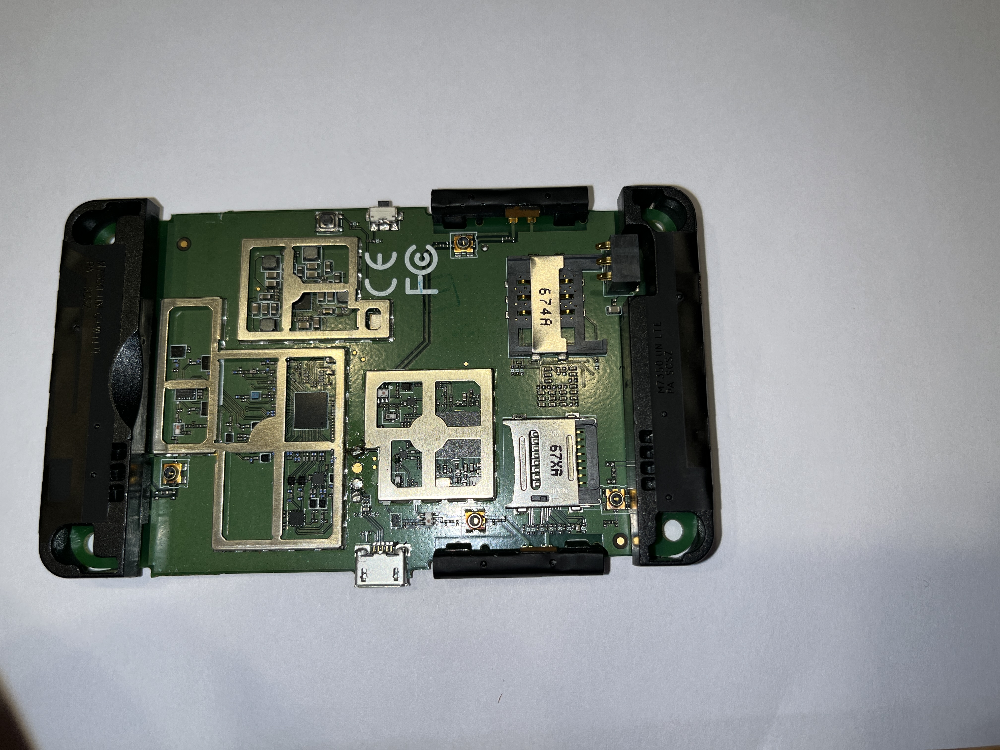

# Device Infos

TP Link Router M7350 v3

## TOC

- [Device Infos](#device-infos)
  - [TOC](#toc)
  - [Photos](#photos)
  - [Notes](#notes)
    - [fastboot](#fastboot)
    - [Firmware](#firmware)
      - [binwalk](#binwalk)
      - [Findings](#findings)
        - [`./system/etc/{passwd-,shadow}`](#systemetcpasswd-shadow)
        - [`./system/etc/lighttpd.user`](#systemetclighttpduser)
        - [`./system/sbin`](#systemsbin)
        - [`./META-INF/com/google/android/updater-script`](#meta-infcomgoogleandroidupdater-script)
        - [Webinterface RCE to start telnet](#webinterface-rce-to-start-telnet)
    - [.dtb files](#dtb-files)
    - [Testpoint and Bootpoint PBL](#testpoint-and-bootpoint-pbl)
    - [Backup methods](#backup-methods)
    - [Start adbd](#start-adbd)
  - [TODO](#todo)
  - [Weblinks](#weblinks)
    - [OpenWRT Board](#openwrt-board)
    - [4pda](#4pda)
    - [OEM](#oem)
    - [Sourcecode](#sourcecode)

## Photos





## Notes

### fastboot

If you remove the battery and plugin USB, lsusb shows:

```
Bus 001 Device 031: ID 18d1:d00d Google Inc. Xiaomi Mi/Redmi 2 (fastboot)
```

```
> fastboot devices
MDM9625	fastboot

```

Above disappears after a few seconds.

If you boot normal, it shows:

```
Bus 001 Device 032: ID 2357:0005 TP-Link M7350 4G Mi-Fi Router
```

Enter fastboot without bootloop

```
fastboot reboot bootloader
```

### Firmware

Device seems to run Android. You can get the firmware here:

[TP-Link Support Page](https://www.tp-link.com/de/support/download/m7350/#Firmware)

The Firmware is not crypted. You are able to take a deeper look into the configs.

#### binwalk

```
binwalk boot.img

DECIMAL       HEXADECIMAL     DESCRIPTION
--------------------------------------------------------------------------------
0             0x0             Android bootimg, kernel size: 3564792 bytes, kernel addr: 0x308000, ramdisk size: 0 bytes, ramdisk addr: 0x308000, product name: ""
2048          0x800           Linux kernel ARM boot executable zImage (little-endian)
18403         0x47E3          gzip compressed data, maximum compression, from Unix, last modified: 1970-01-01 00:00:00 (null date)
3567616       0x367000        Qualcomm device tree container, version: 1, DTB entries: 55
3569664       0x367800        Flattened device tree, size: 49302 bytes, version: 17
3620864       0x374000        Flattened device tree, size: 49218 bytes, version: 17
3672064       0x380800        Flattened device tree, size: 49088 bytes, version: 17
3721216       0x38C800        Flattened device tree, size: 48730 bytes, version: 17
3770368       0x398800        Flattened device tree, size: 49193 bytes, version: 17
3821568       0x3A5000        Flattened device tree, size: 48516 bytes, version: 17
3870720       0x3B1000        Flattened device tree, size: 47693 bytes, version: 17
```

#### Findings

##### `./system/etc/{passwd-,shadow}`

```
root:C98ULvDZe7zQ2:0:0:root:/home/root:/bin/sh
```

Quick search for the hash gives us `oelinux123` as a possible value. We need to check that later.

Source: https://svson.xyz/posts/zte-dongle/part4/

##### `./system/etc/lighttpd.user`

```
admin:admin
```

##### `./system/sbin`

Firmware seems to contain an `adbd`. We need to find a way to start it.

##### `./META-INF/com/google/android/updater-script`

Paths to Files and creating symlinks for autostart ect. Lets try to modify that to activate adb.

##### Webinterface RCE to start telnet
In the linked 4pda forum thread is a poc for a Remote Code Execution vuln which allows to start the telnet daemon. There are only windows scripts linked right now. We should build a shellscript to invoke it.

More about this [here](webinterface_rce_telnet/README.md)

We started implementing a command line tool in `[tp-opener/](tp-opener/)`

### .dtb files

The .dtb files of HW rev v3 and v4 are stored in [dtb_files](dtb_files/) and can be visualized with [dtvis](https://github.com/platform-system-interface/dtvis/)

### Testpoint and Bootpoint PBL

There has been posted images on 4PDA to points in another revisions. Could be the same for our device. Take a look [here](assets/4pda/README.md)

### Backup methods

4PDA has found several ways to backup the installed firmware.

[https://4pda.to/forum/index.php?showtopic=669936&view=findpost&p=110738476](https://4pda.to/forum/index.php?showtopic=669936&view=findpost&p=110738476)

### Start adbd


```
usb_composition
902B
nyy
```

persistent adbd connection should be etablished now

Per cable on your client:

```
adb shell
```


## TODO

- [ ] Compare Kernel 3.4.0 with TP Link Sources
- [ ] Find Qualcomm debug stuff online
- [ ] implement script to start telnet based on the vuln quoted in the 4pad forum
- [ ] Explore Android / iOS App to find hidden Endpoints
- [ ] Can we do Stuff with the ISP Files from the Download Section?
- [ ] Try to get OpenWRT running on the Device
- [x] Find a way to start `adbd`
- [x] Link v3 Firmware instead of v4


## Weblinks

### OpenWRT Board
- http://forum.archive.openwrt.org/viewtopic.php?id=72055
- http://forum.archive.openwrt.org/viewtopic.php?id=69257
- https://forum.openwrt.org/t/add-support-for-tp-link-m7350-v4/132119

### 4pda
- https://4pda-to.translate.goog/forum/index.php?showtopic=669936&st=100&_x_tr_sl=auto&_x_tr_tl=de&_x_tr_hl=de&_x_tr_pto=wapp#entry95895999 (translated)
- https://4pda.to/forum/index.php?showtopic=669936&st=100#entry95895999 (russian)

### OEM

- http://www.tp-link.de/products/details/cat-5032_M7350.html

### Sourcecode

- https://archive.org/download/tp-link-gpl-source/LTE/M7350/
- https://static.tp-link.com/resources/gpl/M7350v3_en_gpl.tar.gz
