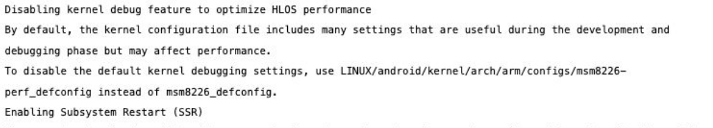

# Qualcomm Debug

## Links

- https://github.com/P1sec/QCSuper/blob/master/docs/The%20Diag%20protocol.md
- https://forum.gsmhosting.com/vbb/f606/qualcomm-diag-mode-enable-diag-port-qualcomm-phones-2618360/
- https://osmocom.org/projects/quectel-modems/wiki/Diag
- https://github.com/bcyj/android_tools_leeco_msm8996/blob/master/diag/mdlog/diag_mdlog.c
- https://github.com/bcyj/android_tools_leeco_msm8996/tree/master
- https://osmocom.org/projects/quectel-modems/wiki/Diag_mdlog
- https://zerodayengineering.com/research/slides/CCC2020_AdvancedHexagonDiag.pdf
- https://github.com/openpst/qcdm
- https://github.com/srlabs/snoopsnitch

## WIP

### Following the [diag protocol guide](https://github.com/P1sec/QCSuper/blob/master/docs/The%20Diag%20protocol.md)

diag interface is mapped in `/dev/`

```bash
# ls /dev/diag
/dev/diag
```

reading does not work without more fiddling

```bash
/ # tail -f /dev/diag
tail: read error: Bad address
tail: read error: Bad address
tail: read error: Bad address
tail: read error: Bad address
^C
/ # cat /dev/diag
cat: read error: Bad address
```

try to activate diag mode per fastboot, did not helped

found `/usr/bin/diag_mdlog`, maybe this website helps: https://osmocom.org/projects/quectel-modems/wiki/Diag_mdlog

This needs an SD Card

```bash
/ # diag_mdlog
diag_mdlog: Fail creating directory fordiag_pid file
 diag_mdlog: Unable to open Pid File,errno: 2
 ODL feature will loose data

diag_mdlog: Continuing with default directory path /sdcard/diag_logs/20160331_152751
diag_mdlog: Unable to create directory, errno: 2 Exiting....
```

sd card needs to be ext2

even with sdcard, we can not use this tool yet. The errno 2 is linked here:

https://github.com/bcyj/android_tools_leeco_msm8996/blob/master/diag/mdlog/diag_mdlog.c#L245

```c
DIAG_LOGE("\n diag_mdlog: Unable to open pid file, errno: %d\n", errno);
```

so we know, we can't spawn the process. At the moment, i think, i need to activate diag mode somehow

Maybe we need a custom kernel to activate debugging?


Source: https://zerodayengineering.com/research/slides/CCC2020_AdvancedHexagonDiag.pdf Page 28

more about `/dev/diag` on Page 42 in the same PDF

[`SnoopSnitch`](https://github.com/srlabs/snoopsnitch) can enable protocol dumps by sending an obscure blob of QCDM commands

